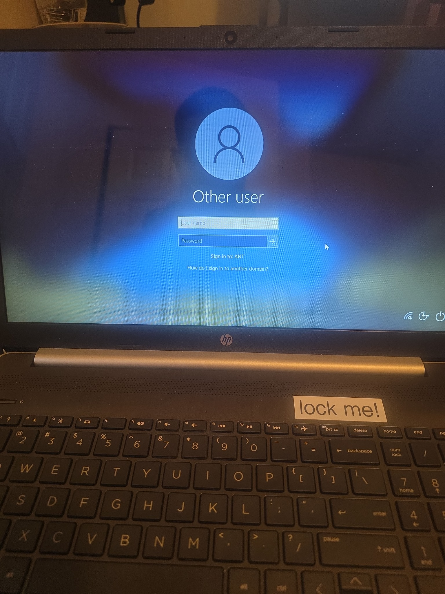
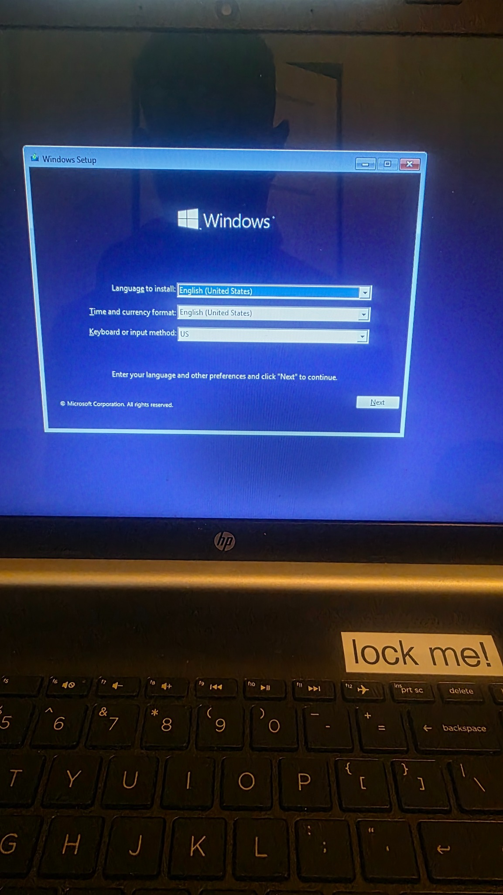
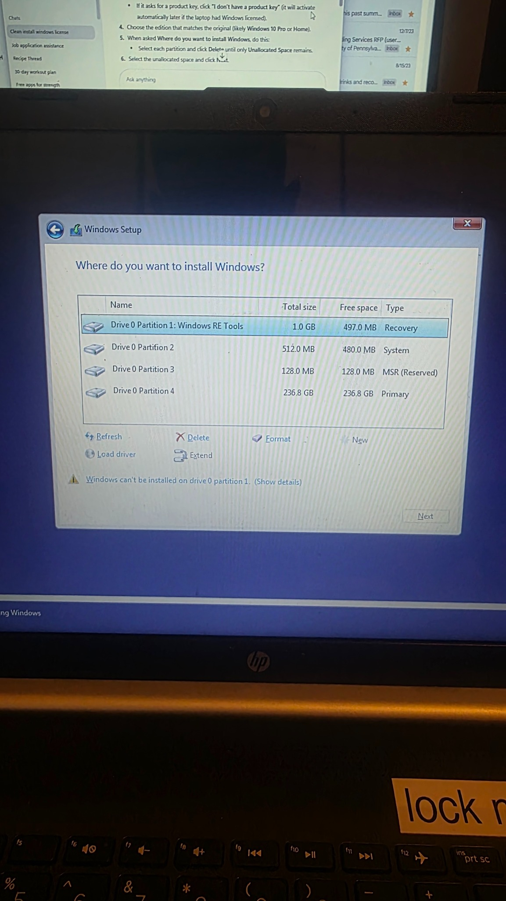
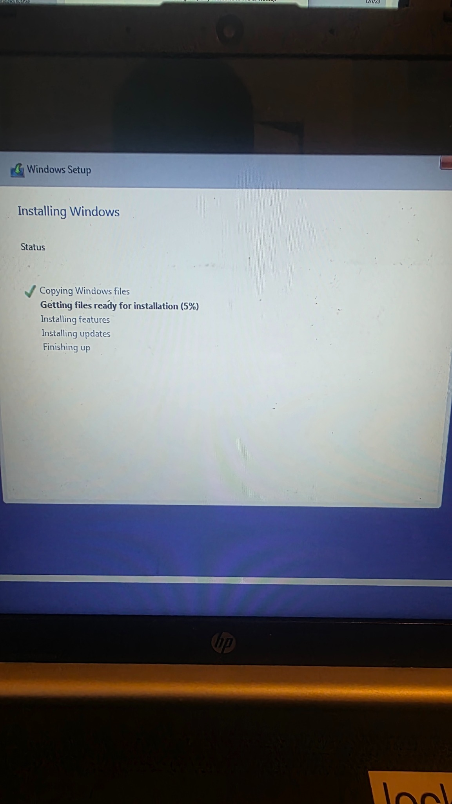
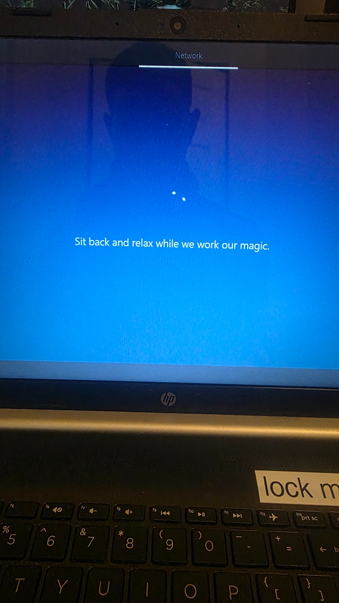
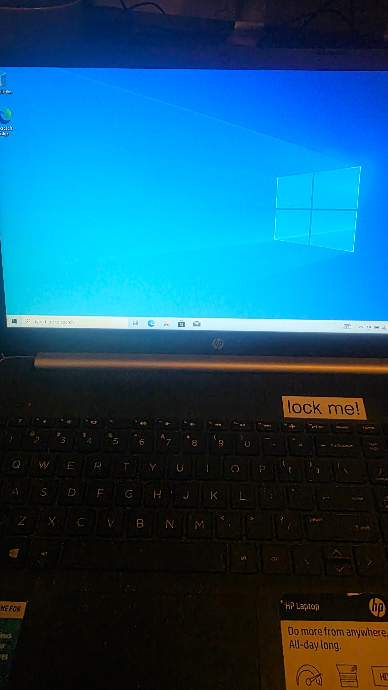

# Domain‑Locked Laptop Recovery

This project documents how to perform a clean install of Windows on a laptop that was previously locked to a domain environment. Using bootable USB installation media and the steps below, you can wipe the machine and reinstall Windows, removing the domain lock while preserving the underlying OEM license.

## Overview

I received an HP laptop that booted to a domain login screen. Since I didn't have the domain credentials, I had to reinstall Windows from scratch. I created a bootable USB installer, configured the BIOS to boot from USB, wiped the existing partitions and installed Windows 10. Once installation completed, the machine activated automatically using the OEM license.

This repository contains:
* **Step‑by‑step instructions** with required keystrokes.
* **Troubleshooting tips** for common issues when booting from USB or activating Windows.
* **Screenshots** documenting each phase of the process.

## Prerequisites

* A USB flash drive (8 GB or larger).
* Access to another computer with internet connectivity to download the Windows ISO and create installation media.
* Approximately 30–45 minutes of time.

## Step 1 – Create Windows Installation Media

1. On a separate computer, open the [Microsoft Windows 10 download page](https://www.microsoft.com/software-download/windows10).
2. Click **Download tool now** under *Create Windows 10 installation media* and run the downloaded `MediaCreationTool.exe`.
3. When prompted, select **Create installation media for another PC** and click **Next**.
4. Choose your **Language** (English), **Edition** (Windows 10), and **Architecture** (64‑bit), then click **Next**.
5. Insert your USB drive, select **USB flash drive**, and allow the tool to download Windows and create the bootable installer.

## Step 2 – Boot the Locked Laptop From USB

1. Insert the bootable USB drive into the locked laptop.
2. Power off the laptop completely.
3. Power it back on and immediately press the **Esc** key repeatedly (on some HP models you may need **F9**, **F10** or **F12**) to enter the boot menu.  
   *Troubleshooting:* If the key doesn’t work, check the manufacturer’s documentation or try other function keys; some systems require **F2** or **Del** to access the BIOS.
4. From the boot menu, select the USB drive to boot from it.  
   

## Step 3 – Wipe the Drive and Install Windows

1. When the Windows Setup screen appears, choose your language, time and currency format, and keyboard input, then click **Next**.  
   
2. Click **Install now**.
3. If prompted for a product key, select **I don’t have a product key**. Most OEM laptops will activate automatically once Windows is installed and connected to the internet.
4. Select the edition that matches your original license (e.g., Windows 10 Home or Pro) and click **Next**.
5. When asked *Where do you want to install Windows?*, you’ll see multiple partitions (Recovery, System, MSR, Primary). Highlight each partition and click **Delete** until all entries show **Unallocated Space**.  
   
6. Select the unallocated space and click **Next**. Windows will create the necessary partitions and begin installation.

## Step 4 – Let Windows Install and Complete Setup

1. Windows will copy files and get them ready for installation. The progress bar will advance through **Copying Windows files**, **Getting files ready**, **Installing features**, and **Installing updates**.  
   
2. During the installation, you may see messages like “Sit back and relax while we work our magic.” Let the process run without interruption.  
   
3. After restarting several times, Windows will present the initial setup experience (OOBE). Choose your region, keyboard layout, and connect to Wi‑Fi.
4. If the laptop previously had an OEM license, Windows should activate automatically once it connects to the internet. You can verify activation under **Settings → Update & Security → Activation**.
5. When setup completes, you should see a fresh Windows desktop.  
   

## Troubleshooting Tips

* **Boot menu doesn’t show USB drive:** Ensure the USB stick is properly created and plugged into a USB‑A port. You might need to disable Secure Boot or enable Legacy USB support in the BIOS.
* **Product key prompt:** If Windows won’t let you skip entering a key, double‑check you selected the correct edition that matches your original license. Choosing the wrong edition can prevent automatic activation.
* **Activation issues:** Run the Windows Activation troubleshooter under **Settings → Update & Security → Activation** or use the command `slmgr /dlv` in Command Prompt to view license status.
* **Domain policies persist:** If the laptop re‑joins the domain automatically, the reinstall may have restored recovery partitions. Delete all partitions as described in Step 3 to ensure a completely clean installation.

---

This project demonstrates my ability to work with Windows licensing, domain‑joined systems, BIOS boot menus and USB installation media. It also highlights documentation skills through detailed steps, keystrokes and troubleshooting guidance.
